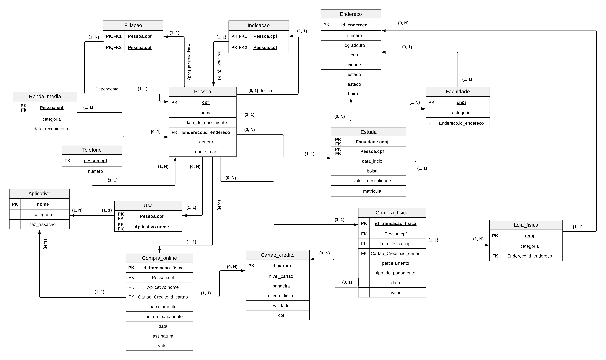

# Projeto Riemann 
### Scripts BD
Scripts usados para a cadeira de Banco de dados, com base no que está sendo desenvolvido no projeto.

---

## Descrição dos dados - o minimundo.
  Um jovem possui CPF, nome, nome da mãe, data de nascimento, gênero, um ou mais telefones e endereço(numero, estado, cidade, bairro, logradouro e CEP). Um jovem pode estudar em várias Faculdade cada faculdade possui um CNPJ, categoria e um endereço (numero, estado, cidade, bairro, logradouro e CEP. 
  Ao longo da vida ele pode estudar em mais de uma faculdade e fazer mais de um curso por isso para manter o histórico são salvo dados como: matrícula, data de início, estimativa término, curso, valor da mensalidade e se aquele jovem possui ou nao bolsa na instituicao.Um jovem ja pode ganhar uma renda mensal que vem de uma categoria como estágio,de uma  iniciação que ele possa realizar e entre outros, essa renda mensal pode ou não ter uma data certa de recebimento.
  
  Um jovem geralmente usa aplicativos para fazer compras online, tais como: Ifood, Rappi, Uber, Netflix, esses aplicativos possuem nome ,categoria, se possuem algum tipo de assinatura ou até mesmo se fazem transações. Para armazenar isso no banco de dados  do projeto e mapear o histórico de compras onlines existem dados como id de transação online para cada transação ser única, existe também, o tipo de pagamento, valor, data, se é uma assinatura ou não e se foi parcelada a compra.
  
  Um jovem pode fazer compra online usando um cartão de crédito que não necessariamente é o seu, assim cada compra guarda alguns dados do cartão para manter o histórico, são esses: bandeira do cartão, nivel do cartão(platinum.gold,...), Cpf, quatro últimos dígitos e validade juntos são o identificador do cartão. Cartão de crédito também pode ser usado em loja física que possui um CNPJ e nome como identificadores uma categoria e um endereço, para fazer compras em lojas físicas alguns dados, assim como, uma compra em uma loja online são necessários, um id de transação, parcelamento, tipo de pagamento, valor e data.

## Modelo Relacional 

  A partir da definição do minimundo e das entidades e sua relação, a equipe começou a desenvolver o modelo relacional e após a normalização foi desenvolvido o modelo de entidade de relacionamento. Este pode ser encontrado abaixo:
  
## Desenvolvedores:
[Otacilio Maia](https://github.com/OtacilioN)
[Maria do Carmo](https://github.com/mcaac)
[Pedro Henrique](https://github.com/Peedrohj)

